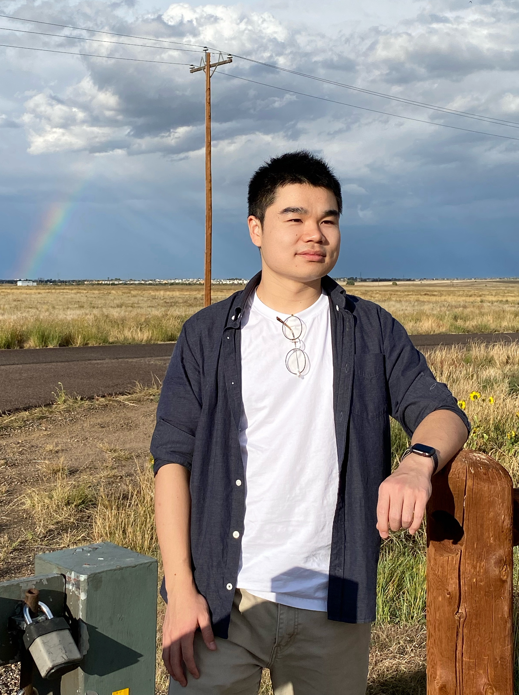

# Qian Huang, Ph.D.

<table border="0">
  <tr>
    <td></td>
    <td>
      
Computer Vision and Deep Learning Engineer

      
NVIDIA, Santa Clara, CA

      
qian.huang140 AT duke DOT edu

      
<a href="cv2022.pdf">cv</a>

    </td>
  </tr>
</table>

---
I am a Software Engineer on the Computer Vision and Deep Learning track at NVIDIA. My research focuses on computational imaging, computer vision, and deep learning.

I received my Ph.D. degree in electrical and computer engineering from Duke University in 2022, advised by Dr. David J. Brady. I received my B.S. degree in electronic information science and technology from Nanjing University in 2018.

## Publications
[Google Scholar](https://scholar.google.com/citations?user=MbdZteAAAAAJ&hl=en)

_Scatter Ptychography_ [arXiv]() [code]()

**Qian Huang**, Zhipeng Dong, Yuzuru Takashima, Timothy J Schulz, David J Brady

Tech report, 2022

_Array Camera Image Fusion using Physics-Aware Transformers_ [preprint]() [code]()

**Qian Huang**, Minghao Hu, David J Brady

Journal of Information Systems and Telecommunication (JIST), 2022

_Deep learning for camera autofocus_ [paper]() [code]()

Chengyu Wang, **Qian Huang**, Ming Cheng, Zhan Ma, David J Brady

IEEE Transactions on Computational Imaging (TCI), 2021

_Multispectral image intrinsic decomposition via subspace constraint_ [paper]() [code]()

**Qian Huang**, Weixin Zhu, Yang Zhao, Linsen Chen, Yao Wang, Tao Yue, Xun Cao

Proceedings of the IEEE Conference on Computer Vision and Pattern Recognition (CVPR), 2018

_Multispectral Focal Stack Acquisition Using A Chromatic Aberration Enlarged Camera_ [paper]() [code]()

**Qian Huang**, Yunqian Li, Linsen Chen, Xiaoming Zhong, Jinli Suo, Zhan Ma, Tao Yue, Xun Cao

Proceedings of IEEE International Conference on Image Processing (ICIP), 2017